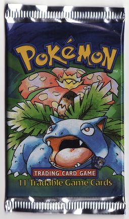
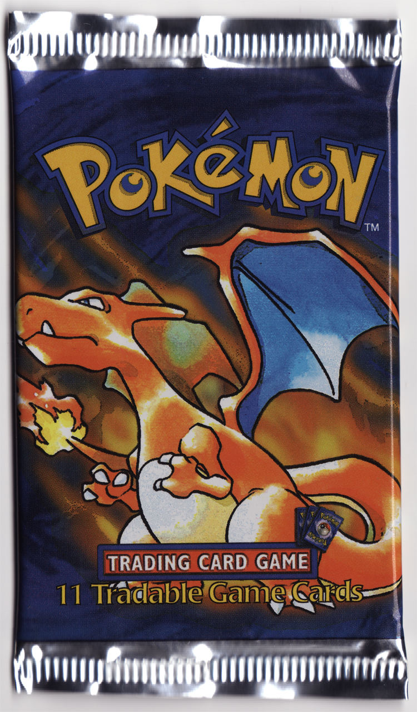

# Litepaper


## Project introduction

Base Set is the name given to the first main expansion of the Pokémon Trading Card Game. In Japan, it was released as Expansion Pack, the first expansion in the Pokémon Card Game. It is based on Pokémon Red, Blue, and Green, featuring Generation I Pokémon. The English expansion was released on January 9, 1999, while the Japanese expansion was released on October 20, 1996. Although not part of the TCG, Bandai Pokémon Cards Part 1 Green & Part 2 Red (September 1996) is regarded as pre-dating the Japanese Base set, and therefore is the oldest known Pokémon Card release.<br/>

The card list is available here : https://bulbapedia.bulbagarden.net/wiki/Base_Set_(TCG) <br/>

The original card rules are availabe here : https://www.docdroid.net/h266/nintendo-power-1999-pokemon-trading-card-game-pdf <br/>


## Collection 


A booster containing 11 cards is offered at the price of 0.01 ether.<br/>
A entire display containing 36 boosters (396 cards) is offered at the price of 0.3 ether (instead of 0.36 ether, the price of 36 boosters).<br/>
The total number of boosters available is 3600000.<br/>


## Booster composition and rarity



A booster is made up of 11 cards with different levels of rarity:
- 2 common energy cards
- 5 common cards (pokémon or trainer)
- 3 uncommon cards (pokémon, trainer or energy)
- 1/3 chance to get a holographic card (pokémon), otherwise 2/3 chance to get 1 rare card (pokémon or trainer)

The rarity level of all the cards can be viewed here : https://www.pokecardex.com/series/BS


## How does it work ?

Pre-sale period : 2024-09-30 00h00 to 2024-10-06 23h59

During the private sales period, the owner can add addresses in the allow list.
Then, the registered users can buy 2 boosters at most.
After buying it, the users can mint the 11 nft from each booster.

Public sales : since 2024-10-07, 00h00

During the public sales period, all the users can buy boosters and displays.
It is possible to buy a maximum of 35 boosters at a time and a maximum of 6 displays at a time.
A user can stock a maximum of 216 boosters.

The maximum supply is 3600000 boosters.


## Using Merkle Tree for Whitelist

The merkle tree algorithm is commontly used as encrypted data to verify if an address is included or not in a whitelist.

A Merkle tree is a tree in which every "leaf" node is labelled with the cryptographic hash of a data block, and every node that is not a leaf (called a branch, inner node, or inode) is labelled with the cryptographic hash of the labels of its child nodes. A hash tree allows efficient and secure verification of the contents of a large data structure. A hash tree is a generalization of a hash list and a hash chain. 

### Generate the whitelist

-   Add all the address you want to include in the whitelist in the array of the "./config/registeredAddressForWhitelist.js" file.
-    Run the script :
```bash 
node scripts/merkleTree.js
```
You can retrieve the root hash to add it to the contract parameters.
Moreover, a new file named "whiteList.json" is created containing the leaf and the proof of all the whitelist addresses.
During the presale period, the address will be verified and only the addresses in the whitelist will be able to buy a booster.


## Conclusion

We invite anyone and everyone who loves Pokémon to join us and enjoy the first ever card collection of Pokémon.

